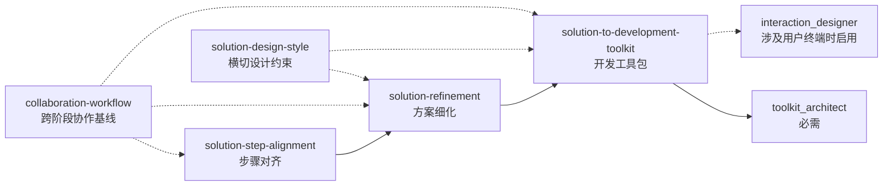
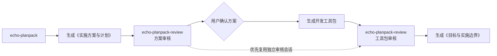

# 技能系列索引

本文件记录当前 Skill、配套 Agent 及其衔接关系。设计过程和历史决策保存在 `research/`，不在这里重复。

## 关系类型

- **非系列 Skill**：提供独立能力，不属于任何业务流程系列，也不占据固定流程节点。
- **主链 Skill**：负责一个明确阶段，并在满足确认条件后衔接下一阶段。
- **横切 Skill**：提供贯穿多个阶段的工作方式或设计约束，不占据固定流程节点。
- **审核 Skill**：由主 Skill 显式调用，在隔离判断下完成审核。
- **配套 Agent**：为某个阶段提供稳定角色、文件所有权和执行边界。

## 非系列 Skill

| Skill | 作用 | 使用方式 |
|---|---|---|
| `jamie-working-agreements` | 将高置信度历史纠偏提炼成 Jamie 的个人工作偏好，在任务开始前校准自主判断 | 非简单任务进入调研、设计、实施、协作或交付时主动使用，并只加载当前场景的 `references/` |

`jamie-working-agreements` 不属于任何系列，因此不标注所属系列。它不占据业务流程的固定阶段，也不替代具体任务 Skill，只负责在任务开始前应用个人偏好；历史对话转折仅用于维护这些偏好的依据。`collaboration-workflow` 继续负责通用的多步骤人机协作循环。

## 方案协作系列

用于把用户给出的目标逐步收敛为已确认方案，再转换为可独立领取的开发工具包。

### 主链

1. `solution-step-alignment` 根据目标和当前事实形成连续的目标达成步骤，关闭影响主线的关键决策。
2. 用户确认后，在同一回复中立即进入 `solution-refinement`，补齐使方案成立的必要设计和验收目标。
3. 用户再次确认后，在同一回复中进入 `solution-to-development-toolkit`，生成工具包索引、交互设计和任务包。
4. 工具包完成一致性检查后停止，不自动开始代码实现或领取任务包。

确认消息是等待状态，不是阶段完成后的独立交付。用户确认后必须实际加载并执行下一 Skill，不能只告知“下一步可以使用”。

### 横切 Skill

| Skill | 作用 | 与主链的关系 |
|---|---|---|
| `collaboration-workflow` | 负责多步骤工作中的目标理解、事实探查、少量关键决策升级和证据化交接 | 作为跨阶段协作基线，不替代任何主链阶段 |
| `solution-design-style` | 约束非简单方案中的边界、不变量、显式模型、确定性和演进方式 | 在设计或修订方案时按需使用，不是自动衔接节点 |

### 配套 Agent

`solution-to-development-toolkit` 使用两种专业角色：

| Agent | 配置 | 启用条件 | 文件所有权 |
|---|---|---|---|
| `toolkit_architect` | [`agents/toolkit-architect.toml`](../agents/toolkit-architect.toml) | 生成开发工具包时必需 | 工具包 `README.md`、任务包结构和全部任务包 |
| `interaction_designer` | [`agents/interaction-designer.toml`](../agents/interaction-designer.toml) | 涉及前端、客户端或其他用户终端时启用 | `交互设计.md`；后续只读检查终端任务包 |

两个 Agent 只写主对话明确分配的文档路径。主对话负责整合分歧和关闭关键决策，不让两个 Agent 并发修改同一文件。

## Echo 实施规划系列

用于把已经确定的功能需求转换为版本化实施方案、开发工具包和最终目标边界，并通过独立审核控制事实、范围与对象一致性。

| Skill | 类型 | 调用方式 | 职责 |
|---|---|---|---|
| `echo-planpack` | 主链 Skill | 可隐式或显式触发 | 规划、版本管理、确认、工具包生成和最终边界总结 |
| `echo-planpack-review` | 审核 Skill | 只允许显式调用 | 独立审核方案或工具包，生成外部审核记录，不修改被审核对象 |

`echo-planpack-review` 是交给独立审核子代理加载的 Skill，不是固定的自定义 Agent TOML。方案复审和工具包审核优先复用同一独立审核会话；无法维持独立性或上下文时才重新建立审核者。

该系列的设计、验证和复盘材料见 [`research/plan-feature-execution/`](../research/plan-feature-execution/README.md)。

## 维护规则

- 新增、删除、重命名 Skill 或配套 Agent，或改变 Skill 的系列归属时，同步更新本文件。
- 改变阶段顺序、确认断点、调用方式或文件所有权时，同步更新对应系列。
- 当前关系以 `skills/*/SKILL.md` 和 `agents/*.toml` 为准；本文件用于索引，不复制完整行为规则。
- 历史过程和实验结论放入 `research/`，不把迁移记录、安装状态或命令输出写进本文件。
