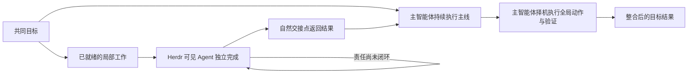

# 模式与失败分析

## 1. 有效模式

### 1.1 多智能体默认进入可见 Herdr 工作面

用户两次立即发现新任务被交给不可见内置子代理。这表明可见性不是界面偏好，而是协作契约：用户需要看到谁在负责什么、是否持续工作以及何时形成出口。

一般化规则：先判断是否需要多智能体；需要时默认使用 Herdr。单智能体任务留在当前会话，只有用户或必需工作流明确指定时才使用其他机制。已有不可见任务完成当前包后再改道，不中断半成品。

### 1.2 主智能体是持续执行者，不是调度岗位

用户先后要求不要因并行打断原工作、快速推进、不要一直等待 Agent 返回以及“专心干正事”。这些纠正共同说明：触发 Skill 的主智能体仍应亲自持有并完成关键工作；Herdr Agent 是加速器，不是把主智能体替换成观察者的理由。

一般化规则：派发前主智能体保留一项直接推进目标的具体责任；派发后立即继续做。只有确实没有可推进工作且下一步依赖 Agent 结果时才等待。

### 1.3 局部工作派发，全局影响工作留在主智能体

原 session 中环境、服务、共享语义、整合和全量验证都会改变多个工作包的前提。把这类动作交给独立 Agent，会增加时机冲突和中间态误判；主智能体统一择机执行，才能把全局事实与当前目标对齐。

一般化规则：Agent 只承接前置已满足、边界清楚、可以独立交付的局部包。共享契约、公共配置、跨包改动、共享运行环境、全量验证和交付动作由主智能体负责；Agent 可以收集局部证据，不能替代全局决策和执行。

### 1.4 正确分配比追加检查更重要

同一 Agent 连续负责紧密耦合文件和责任链时，纠偏后的返工路径较短。`full_regression` 在另一负责人仍修改测试文件时运行全量回归产生假失败，本质上不是缺少一次状态检查，而是把具有全局读取影响的验证错误地当成可并发工作包。

一般化规则：一个耦合责任只设一个负责人；有先后依赖就明确串联。发生冲突先重划所有权和依赖，不通过更频繁的扫描、轮询或重跑补偿错误分配。

### 1.5 完整责任、自主推进与直接交接

用户要求 Agent 在完成一项后持续干下去。Herdr Agent 与主智能体能力相同，合理做法是交付一个有边界的完整责任，让负责人自行核对事实、规划步骤并推进到闭环，而不是由主智能体预制后继队列或逐项续派。下游直接读取上游原始结论可以减少主智能体转述造成的串行中继。

一般化规则：向 Agent 说明责任结果、所有权、关键事实和权限边界，允许它自主决定责任域内的必要工作。用稳定 Agent 名称或稳定产物作为交接锚点；没有真实责任时不扩容，结果开始堆积而主智能体尚未整合时先收口。

## 2. 失败模式

| 失败模式 | Session 证据 | 根因 | Skill 护栏 |
|---|---|---|---|
| 可见与不可见代理混用 | 用户两次指出看不到“小弟” | 多智能体机制没有统一 | 多智能体默认 Herdr；其他机制必须由用户或必需工作流明确指定 |
| 主智能体退化成等待者 | 用户指出最慢的是一直等待 Agent 的调度者 | 派发后放弃了自己的执行责任 | 派发前保留主线工作，派发后立即继续执行 |
| 并行打断原工作 | 用户明确要求不要因新并行要求打断此前工作 | 把调度当成替代主线的新任务 | 新工作只占用局部 Agent 包，不接管主智能体已开始的责任 |
| 预占未就绪任务 | A02/A03 在 Gate 未满足时占用 Agent | 把未来任务当成当前并行度 | 只派发已有事实前置和独立出口的工作 |
| 高频等待与读取 | `wait/read/list` 活动密度很高 | 把状态检查当成推进，并假设完成状态能主动反馈 | 主智能体只在自己的自然检查点、真实依赖或用户询问时拉取一次状态快照 |
| 每项任务都等待续派 | 用户要求 Agent 完成后持续干下去 | 把完整智能体当成一次性动作执行器 | 派发完整局部责任，允许负责人自行审查、规划并持续推进 |
| 做到一半换人 | 用户明确禁止突然换人 | 所有权绑定临时步骤而非责任链 | 唯一且稳定的局部负责人，纠偏默认不换人 |
| 调度者传话损失 | 用户要求 Agent 直接读取上游结论 | 主智能体成为串行中继 | 下游直接读取上游或稳定产物 |
| 全量验证读到中间态 | `full_regression` 与测试文件修改并行，出现 1 个假失败 | 全局验证被错误派发为普通并行包 | 全量验证由主智能体在合适时机执行 |
| 共享运行资源互相污染 | Session 暂停全量测试以免污染性能 CPU/RSS | 全局运行活动被拆成独立责任 | 服务、性能和共享环境动作由主智能体统一安排 |
| 启动参数冲突 | Agent 启动曾重复传审批和沙箱参数 | 编排 Skill 越界复制 Herdr 控制规则 | 命令和安全语义完全服从 `herdr` Skill |
| 上下文重置破坏连续性 | 用户明确要求 `/new` 后才重新派发 | 把重置当作常规调度手段 | 当前包自然完成，后续再改道或更换责任 |

## 3. 并行控制模型

这个模型没有独立的“调度者”角色。调度是主智能体执行过程中的一项短暂活动，不能成为其主要工作。Agent 自行判断怎样闭环已经取得的责任，减少主智能体的续派次数。并发增加的前提是存在新的独立责任；如果结果堆积、边界需要频繁协调或工作无法独立交付，就停止扩容并由主智能体收口。

## 4. 效率边界

“所有 Agent 都在工作”不代表系统高效。原 session 曾同时维持多个可见与不可见代理，用户仍认为主智能体是最慢环节。真正有效的并行取决于：

- 主智能体是否持续完成自己的关键工作；
- 局部包是否具备唯一所有权和独立出口；
- Agent 是否能在安全边界内自主审查、规划并闭环责任，而不是每项都等待续派；
- 全局动作是否留在主智能体并选择正确时机；
- 主智能体是否只在自己的自然检查点拉取一次状态，而不是假设 Herdr 存在完成事件回调或持续轮询。

因此 Skill 不设置固定 Agent 数量，也不建立通用检查矩阵。出现冲突时优先修正任务分配；如果修正后仍需高频协调，该工作就不适合独立派发。
